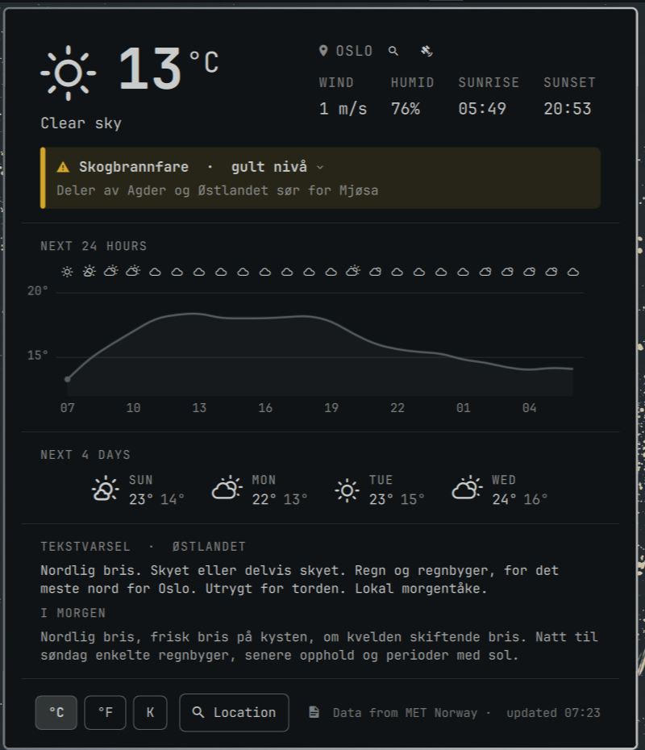

# omarchy-yr-plugin

yr.no weather for the [Omarchy](https://omarchy.org) bar. A theme-tinted
Nerd Font glyph and the temperature in the bar, with a popup showing the
current conditions, a yr-style hour-by-hour graph, and a four-day forecast —
all from **MET Norway's** Locationforecast API, the same data that powers
[yr.no](https://www.yr.no).





The popup, top to bottom:

1. **Current weather** — glyph, temperature and condition; location (with
   search and GPS buttons), wind, humidity, sunrise and sunset (computed
   locally from the coordinates — no extra API calls).
2. **Weather warnings** (farevarsel) — MET's active alerts for the spot,
   coloured by level; click one for the description and advice.
3. **Next 24 hours** — symbols along the top, temperature curve,
   precipitation bars with amounts, hour labels.
4. **Next 4 days** — symbol, day, high / low.
5. **Tekstvarsel** — MET's written forecast for the Norwegian land region
   (today and tomorrow; scrolls when long). Norway only, Norwegian only;
   hides itself elsewhere. Toggle with the  button.
6. **Settings** — `°C | °F | K`, `Location` (opens the search view in place
   of the whole popup), the tekstvarsel toggle, the MET attribution and the
   "updated HH:MM" stamp (click it to reload).

Plugin id: `knutsi.weather-yr`. Requires Omarchy 4.0 or newer (the
Quickshell-based shell with third-party plugin support).

## Install

```bash
omarchy plugin add https://github.com/Knutsi/omarchy-yr-plugin.git --enable
```

`--enable` places the pill in the bar's center section. To put it somewhere
specific:

```bash
omarchy bar put knutsi.weather-yr --after omarchy.clock
omarchy bar move knutsi.weather-yr --section right --index 0
```

It can live next to the stock `omarchy.weather` pill or replace it
(`omarchy bar put omarchy.weather` brings the stock one back).

Update later with `omarchy plugin update knutsi.weather-yr`; remove with
`omarchy plugin remove knutsi.weather-yr`.

## Using it

| Action | Result |
|---|---|
| Left click | Open / close the popup |
| Middle click | Force a refresh (re-detects the location too) |
| Right click | Desktop notification with the current conditions |
| Click the location name, its 🔍 button, or the `Location` settings button | Opens the search view: type a place, pick with ↑/↓ + Enter or click; Esc / ✕ goes back; "Use automatic location" returns to IP auto-detect |
| Click the  button (hero or search view) | Locate with GPS / Wi-Fi positioning through GeoClue — see below. Dimmed with an explanatory tooltip when the service is missing |
| `°C` / `°F` / `K` buttons, or click the unit next to the big temperature | Switch units (persisted in shell.json) |
| Click the "updated HH:MM" stamp | Fetch the forecast again (also re-detects the IP location) |
| Tab / Shift-Tab in the popup | Move to the neighbouring bar panel |

IPC, e.g. for keybindings:

```bash
omarchy-shell shell toggle knutsi.weather-yr      # open/close the popup
omarchy-shell knutsi.weather-yr refresh           # force refresh
omarchy-shell knutsi.weather-yr edit              # open with the location search focused
omarchy-shell knutsi.weather-yr toggleUnit        # °C → °F → K → °C
omarchy-shell knutsi.weather-yr unit imperial     # set a unit directly
omarchy-shell knutsi.weather-yr locate            # GPS fix via GeoClue (if available)
omarchy-shell knutsi.weather-yr textForecast false  # hide/show the tekstvarsel
```

## Location

The plugin shares Omarchy's weather location with the stock widget, so
setting it once applies to both:

```bash
omarchy-weather-location                          # show the current location
omarchy-weather-location --set "Bergen" 60.3913,5.3221
omarchy-weather-location --clear                  # back to auto-detect
```

The state lives in `~/.local/state/omarchy/settings/weather.json` as
`{"name": ..., "latitude": ..., "longitude": ...}` and is watched, so edits
take effect immediately.

Without stored coordinates the position is detected from your public IP
address (via [ipwho.is](https://ipwho.is), falling back to
[geojs.io](https://www.geojs.io)). That is city-level at best and can be
off by a lot on CG-NAT / satellite connections, so set the location
explicitly if the forecast looks wrong. The lookup happens once per shell
session (and on middle-click), not on every refresh.

### Place search

The search asks three services at once and merges the answers:
[Open-Meteo](https://open-meteo.com/en/docs/geocoding-api) (towns and
cities worldwide), [Kartverket](https://www.kartverket.no/en/api-and-data/stedsnavndata)
(Norway's official place-name register — this is what finds farms, hotels,
ski areas and seters such as *Sanderstølen*), and
[Photon](https://photon.komoot.io) (OpenStreetMap, worldwide, typo
tolerant). Only a listed match can be saved; a bare name is never stored
without coordinates.

### GPS / Wi-Fi positioning (GeoClue)

Linux has one standard location service: [GeoClue](https://gitlab.freedesktop.org/geoclue/geoclue).
It combines Wi-Fi positioning (Arch's build points at the open
[beaconDB](https://beacondb.net)), GNSS receivers via gpsd/NMEA, modem GPS
and a static `/etc/geolocation`. Omarchy does not install it, so the 
button is dimmed until you do:

```bash
sudo pacman -S geoclue
```

GeoClue also needs an *authorisation agent* on your session. GNOME ships
one; on Hyprland start the demo agent from `~/.config/hypr/autostart.lua`:

```lua
o.launch_on_start("/usr/lib/geoclue-2.0/demos/agent")
```

then reload Hyprland (or run the agent once by hand). Alternatively skip
the agent by allowing the client outright, as root, in
`/etc/geoclue/conf.d/50-omarchy.conf`:

```ini
[geoclue-where-am-i]
allowed=true
system=false
users=
```

How it behaves:

- The plugin asks for a position **only when you press the button** — never
  on startup or on a timer — and saves the result through
  `omarchy-weather-location`, so the stock weather widget follows too.
- The fix comes from `/usr/lib/geoclue-2.0/demos/where-am-i` (one process,
  one D-Bus connection, 12 s timeout); the name comes from Photon's reverse
  lookup, refined with Kartverket in Norway.
- Where beaconDB has no Wi-Fi data, GeoClue falls back to an IP estimate;
  such coarse fixes are labelled "(approx.)" with the radius shown.
- The demo agent approves any app with a `.desktop` file and shows no
  prompt — the button is the consent step. `submit-data=false` is the
  default, so nothing is uploaded to beaconDB unless you opt in.
- Wi-Fi positioning needs NetworkManager's `wpa_supplicant` backend; it
  yields nothing under `iwd`.

## Settings

Settings are keys on the widget's entry in `~/.config/omarchy/shell.json`,
set with `omarchy bar set`:

| Key | Default | Meaning |
|---|---|---|
| `refreshMinutes` | `15` | Minutes between forecast fetches. Clamped to ≥ 10 — MET Norway asks desktop clients not to poll more often. |
| `unit` | `metric` | `metric` (°C, m/s, mm), `imperial` (°F, mph, in) or `kelvin` (K, m/s, mm). Always metric unless you change it — the system locale is deliberately ignored. |
| `barFormat` | `icon-temp` | `icon-temp` shows glyph + temperature; `icon` shows only the glyph. |
| `graphHours` | `24` | Hours in the hour-by-hour graph (6–48; MET's hourly data runs ~60 h ahead). |
| `textForecast` | `true` | Show the tekstvarsel section (set with `--json`: `omarchy bar set knutsi.weather-yr textForecast false --json`). |
| `textForecastArea` | *(by location)* | Force a text-forecast region, e.g. `Fjellet i Sør-Norge` — the mountain region overlaps the lowland ones and the smallest match wins by default. |

```bash
omarchy bar set knutsi.weather-yr refreshMinutes 30
omarchy bar set knutsi.weather-yr unit kelvin
omarchy bar set knutsi.weather-yr barFormat icon
omarchy bar set knutsi.weather-yr graphHours 48
```

## How it talks to MET Norway

- Forecast: `https://api.met.no/weatherapi/locationforecast/2.0/compact`
- Warnings: `https://api.met.no/weatherapi/metalerts/2.0/current.json?lat=&lon=`
  (fetched with each forecast refresh)
- Tekstvarsel: `https://api.met.no/weatherapi/textforecast/3.0/landoverview`
  (every 3 h; the region is resolved locally by point-in-polygon — yr.no
  itself no longer shows these texts, but MET still publishes them)
- Coordinates are rounded to four decimals, the request identifies itself
  (`User-Agent: omarchy-yr-plugin/<version> github.com/Knutsi/omarchy-yr-plugin`),
  responses are gzip-compressed, and every refresh sends `If-Modified-Since`
  so an unchanged forecast costs a `304` with no body.
- Refreshes are jittered by up to a minute so many installs never line up.
- `403`/`429` responses are not retried until the next interval. Network
  failures retry three times, 2.5 s apart, while the last good forecast
  stays on screen.
- The "current" hour is re-derived from the cached forecast every minute, so
  the bar keeps up between fetches.

## Theme

Everything is drawn with the active Omarchy theme: the bar's foreground
colour and font for the pill and popup, `accent` for hover/selection and the
precipitation bars, `urgent` (the theme's red) for the temperature curve.
Glyphs are from the Nerd Fonts weather set, the same family the stock weather
pill uses, so the two look like siblings. Switching themes restyles the widget
instantly.

## Development

```
manifest.json    plugin manifest
BarWidget.qml    bar pill + popup loader
Panel.qml        data fetching, location handling, popup UI
HourlyGraph.qml  the hour-by-hour graph (Canvas)
AlertBanner.qml  weather warnings
TextForecastSection.qml  tekstvarsel box
Model.js         pure helpers (parsing, symbol → glyph, hourly/daily rollups) — unit-tested
test/            node --test suite with a recorded MET response
```

```bash
node --test                                   # unit tests (Node ≥ 20)
omarchy plugin validate .                     # manifest/layout check
```

Cloning the repo straight into `~/.config/omarchy/plugins/knutsi.weather-yr`
is the quickest dev loop. The shell notices saved files and re-registers the
plugin, but a bar slot that is already mounted keeps its running instance
(Omarchy 4.0.0) — run `omarchy restart shell` to see QML changes.

## Credits and licence

- Weather data, warnings and text forecasts from [MET Norway](https://api.met.no/),
  licensed under [CC BY 4.0](https://creativecommons.org/licenses/by/4.0/) /
  [NLOD 2.0](https://data.norge.no/nlod/en/2.0).
- Place search by [Open-Meteo geocoding](https://open-meteo.com/en/docs/geocoding-api)
  (CC BY 4.0), [Kartverket](https://www.kartverket.no) place names (CC BY 4.0)
  and [Photon](https://photon.komoot.io) — © OpenStreetMap contributors (ODbL).
  IP lookup by [ipwho.is](https://ipwho.is) and [geojs.io](https://www.geojs.io).
- Popup and location handling adapted from Omarchy's stock `omarchy.weather`
  plugin (MIT).

This plugin is MIT licensed — see [LICENSE](LICENSE).
