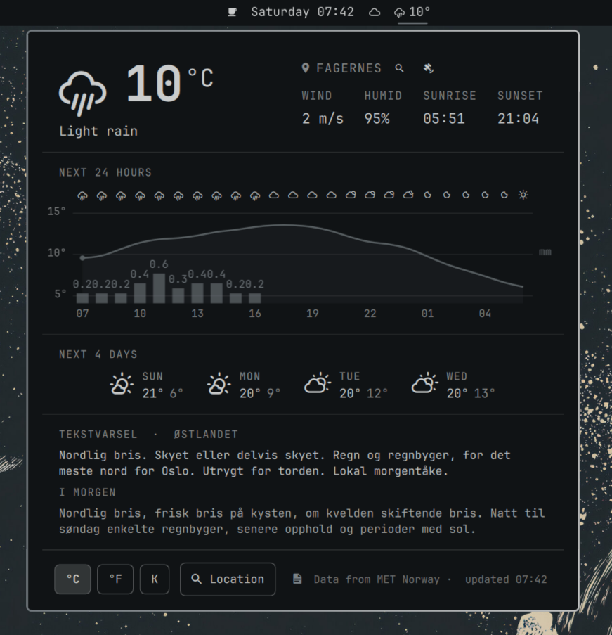
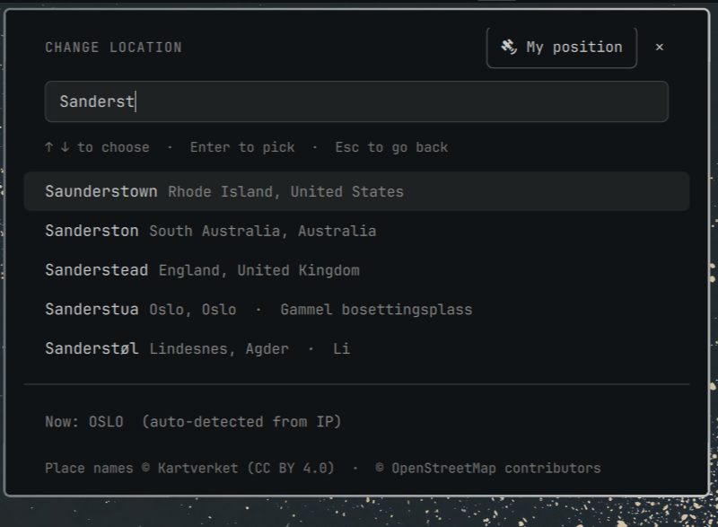

# Yr.no (unofficial) — Omarchy weather plugin

Unofficial yr.no weather for the [Omarchy](https://omarchy.org) bar, built on
the open API of MET Norway — the Norwegian Meteorological Institute, whose
data powers yr.no. Not affiliated with MET or NRK.




## Install

```bash
omarchy plugin add https://github.com/Knutsi/omarchy-yr-plugin.git --enable
```

`--enable` places the pill in the bar's center section. To put it somewhere
specific:

```bash
omarchy bar put io.github.knutsi.yr --after omarchy.clock
omarchy bar move io.github.knutsi.yr --section right --index 0
```

It can live next to the stock `omarchy.weather` pill or replace it
(`omarchy bar put omarchy.weather` brings the stock one back). Update with
`omarchy plugin update io.github.knutsi.yr`. Requires Omarchy 4.0 or newer.

### Uninstall

```bash
omarchy plugin remove io.github.knutsi.yr
```

That deletes `~/.config/omarchy/plugins/io.github.knutsi.yr` and the bar
entry. The plugin keeps no other state of its own: the shared location file
`~/.local/state/omarchy/settings/weather.json` belongs to Omarchy's stock
weather widget (clear it with `omarchy-weather-location --clear`), and the
settings live on the widget's entry in `~/.config/omarchy/shell.json`.

## What you get

A theme-tinted Nerd Font glyph and the temperature in the bar; the popup,
top to bottom:

1. **Current weather** — glyph, temperature (click the unit to cycle °C → °F
   → K), condition, location with search and satellite buttons, wind,
   humidity, sunrise and sunset (computed locally, no extra requests).
2. **Weather warnings** (*farevarsel*) — MET's active alerts for the spot,
   coloured by level; click one for the description and advice. Shown in
   English unless your locale is Norwegian.
3. **Next N hours** — symbols, temperature curve, precipitation bars with
   amounts, hour labels (24 h by default, 6–48 configurable).
4. **Next 4 days** — symbol, day, high / low.
5. **Tekstvarsel** — MET's written forecast for the Norwegian land region
   (today and tomorrow; scrolls when long). Norway only, Norwegian only;
   hides itself elsewhere. Toggle with the document button in the settings
   row.
6. **Settings** — `°C | °F | K`, `Location` (opens the search view in place
   of the whole popup), the tekstvarsel toggle, the MET attribution and the
   "updated HH:MM" stamp (click it to reload).



## Using it

| Action | Result |
|---|---|
| Left click the pill | Open / close the popup |
| Middle click | Force a refresh (re-detects the location too) |
| Right click | Desktop notification with the current conditions |
| Click the location name, its magnifier, or the `Location` button | Search view: type a place, pick with ↑/↓ + Enter or click; Esc / ✕ goes back; "Use automatic location" returns to IP auto-detect |
| Click the satellite button | Locate with GPS / Wi-Fi positioning through GeoClue — see [docs/geoclue.md](docs/geoclue.md). Dimmed with an explanatory tooltip when the service is missing |
| Click the "updated HH:MM" stamp | Fetch again (at most once per 10 s) |
| Tab / Shift-Tab in the popup | Move to the neighbouring bar panel |

IPC, e.g. for keybindings (one handler serves every monitor):

```bash
omarchy-shell shell toggle io.github.knutsi.yr      # open/close the popup
omarchy-shell io.github.knutsi.yr refresh           # force refresh
omarchy-shell io.github.knutsi.yr edit              # open with the search view
omarchy-shell io.github.knutsi.yr locate            # GPS fix via GeoClue (if available)
omarchy-shell io.github.knutsi.yr toggleUnit        # °C → °F → K → °C
omarchy-shell io.github.knutsi.yr unit imperial     # set a unit directly
omarchy-shell io.github.knutsi.yr textForecast false  # hide/show the tekstvarsel
omarchy-shell io.github.knutsi.yr location          # print the location in use
```

## Settings

Settings are keys on the widget's entry in `~/.config/omarchy/shell.json`,
set with `omarchy bar set`:

| Key | Default | Meaning |
|---|---|---|
| `refreshMinutes` | `15` | Minutes between forecast fetches, 10–180. MET Norway asks desktop clients not to poll more often than every 10 minutes. |
| `unit` | `metric` | `metric` (°C, m/s, mm), `imperial` (°F, mph, in) or `kelvin` (K, m/s, mm). Always metric unless you change it — the system locale is deliberately ignored. |
| `barFormat` | `icon-temp` | `icon-temp` shows glyph + temperature; `icon` shows only the glyph (vertical bars always use the glyph). |
| `graphHours` | `24` | Hours in the hour-by-hour graph, 6–48. |
| `textForecast` | `true` | Show the tekstvarsel section (booleans need `--json`). |
| `textForecastArea` | *(by location)* | Force a text-forecast region, e.g. `Fjellet i Sør-Norge` — the mountain region overlaps the lowland ones and the smallest match wins by default. |

```bash
omarchy bar set io.github.knutsi.yr refreshMinutes 30
omarchy bar set io.github.knutsi.yr unit kelvin
omarchy bar set io.github.knutsi.yr graphHours 48
omarchy bar set io.github.knutsi.yr textForecast false --json
```

## Location

The plugin shares Omarchy's weather location with the stock widget, so
setting it once applies to both:

```bash
omarchy-weather-location                          # show the current location
omarchy-weather-location --set "Bergen" 60.3913,5.3221
omarchy-weather-location --set "Bergen"           # name only: geocoded once, coordinates stored
omarchy-weather-location --clear                  # back to auto-detect
```

The state lives in `~/.local/state/omarchy/settings/weather.json` and is
watched, so edits take effect immediately.

Without stored coordinates the position is detected from your public IP
address (via [ipwho.is](https://ipwho.is), falling back to
[geojs.io](https://www.geojs.io)) — city-level at best, and often off on
CG-NAT or satellite connections. Set the location explicitly if the
forecast looks wrong. The lookup happens once per shell session (and on
middle-click), not on every refresh.

**Place search** asks three services at once and merges the answers:
[Open-Meteo](https://open-meteo.com/en/docs/geocoding-api) (towns and
cities worldwide), [Kartverket](https://www.kartverket.no/en/api-and-data/stedsnavndata)
(Norway's official place-name register — this is what finds farms, hotels,
ski areas and seters such as *Sanderstølen*), and
[Photon](https://photon.komoot.io) (OpenStreetMap, worldwide, typo
tolerant). Only a listed match can be saved.

**GPS / Wi-Fi positioning** uses GeoClue when it is installed; the satellite
button explains what is missing otherwise. Setup, privacy notes and the
accuracy caveats are in [docs/geoclue.md](docs/geoclue.md).

## How it talks to MET Norway

- Forecast: `https://api.met.no/weatherapi/locationforecast/2.0/compact`
- Warnings: `https://api.met.no/weatherapi/metalerts/2.0/current.json?lat=&lon=&lang=`
  (fetched with each forecast refresh)
- Tekstvarsel: `https://api.met.no/weatherapi/textforecast/3.0/landoverview`
  (every 3 h, only for positions in Norway; the region is resolved locally
  by point-in-polygon — yr.no itself no longer shows these texts, but MET
  still publishes them)
- Coordinates are rounded to four decimals, the request identifies itself
  (`User-Agent: omarchy-yr-plugin/<version> github.com/Knutsi/omarchy-yr-plugin`),
  responses are gzip-compressed, and every refresh sends `If-Modified-Since`
  so an unchanged forecast costs a `304` with no body.
- One shared service does the fetching no matter how many monitors show the
  pill; refreshes are jittered by up to a minute so many installs never line
  up; `403`/`429` responses are not retried until the next interval; network
  failures retry three times, 2.5 s apart, while the last good forecast
  stays on screen (the pill shows a "not available" glyph with the error in
  its tooltip when nothing could ever be fetched).

## Dependencies and privacy

Everything it needs ships with Omarchy: `curl`, `sh`, `timeout`, `grep`,
`pgrep` and the Quickshell shell itself. No packages are installed, no
privileges are requested, and the only files written are your own
`shell.json` entry (via `omarchy bar set`, on a click) and the shared
location file (via `omarchy-weather-location`, on a click).

Optional, user-installed: [`geoclue`](https://archlinux.org/packages/extra/x86_64/geoclue/)
enables the satellite button. The plugin only *detects* it; installing it is
your decision and command.

Network services used at runtime (all HTTPS, no keys):
[api.met.no](https://api.met.no/) (forecast, warnings, tekstvarsel),
[geocoding-api.open-meteo.com](https://open-meteo.com/en/docs/geocoding-api),
[api.kartverket.no](https://api.kartverket.no/stedsnavn/v1/),
[photon.komoot.io](https://photon.komoot.io), and for IP-based auto-detect
[ipwho.is](https://ipwho.is) / [get.geojs.io](https://www.geojs.io).

## Theme

Everything is drawn with the active Omarchy theme: the bar's foreground
colour and font for the pill and popup, `accent` for hover/selection. The
hourly graph — temperature curve, rain bars, axes — is painted in the
foreground colour at different opacities rather than in `accent`/`urgent`, so
it stays quiet even in themes with a loud accent or a bright red. Warning
banners use MET's own awareness colours (yellow/orange/red) on purpose. Glyphs come from the Nerd Fonts weather set, the same family the
stock weather pill uses. Switching themes restyles the widget instantly.

## Development

```bash
node --test                                        # unit tests (Node ≥ 20)
omarchy plugin validate .                          # manifest/layout check
/usr/lib/qt6/bin/qmllint -I "$OMARCHY_PATH/shell" *.qml
```

`qmllint` cannot resolve the shell's `qs.*` modules or the untyped `bar`
object, so it reports "unqualified access" and "member not found" warnings
for every plugin, first-party ones included; treat new warning *kinds* as
the signal.

Layout (flat, as Omarchy expects):

```
manifest.json            plugin manifest (kinds: service + bar-widget)
Service.qml              the single shared instance: location, weather, search, settings, IPC
  LocationService.qml    weather.json, IP detection, GeoClue, persistence
  WeatherService.qml     forecast, warnings, tekstvarsel, derived views
  GeocodeSearch.qml      three-source place search (GeocodeSource.qml)
  CurlRequest.qml        one curl process, result from onExited
  MetFetcher.qml         MET request with If-Modified-Since and a request key
BarWidget.qml            per-monitor pill, binds to the service
Panel.qml                per-monitor popup: HeroSection, AlertBanner, HourlyGraph,
                         ForecastDaysRow, TextForecastSection, SettingsRow, SearchView
Model.js                 pure helpers, unit-tested (test/*.test.mjs, fixtures documented)
```

Cloning the repo straight into `~/.config/omarchy/plugins/io.github.knutsi.yr`
is the quickest dev loop. The shell notices saved files and re-registers the
plugin, but an already mounted bar slot keeps its running instance (Omarchy
4.0) — run `omarchy restart shell` to see QML changes. See
[CHANGELOG.md](CHANGELOG.md) for releases.

## Contact

Questions, ideas or bug reports: open an
[issue](https://github.com/Knutsi/omarchy-yr-plugin/issues), or reach me on
X at [@knutsi](https://x.com/knutsi).

## Credits and licence

- Weather data, warnings and text forecasts from [MET Norway](https://api.met.no/),
  licensed under [CC BY 4.0](https://creativecommons.org/licenses/by/4.0/) /
  [NLOD 2.0](https://data.norge.no/nlod/en/2.0).
- Place search by [Open-Meteo geocoding](https://open-meteo.com/en/docs/geocoding-api)
  (CC BY 4.0), [Kartverket](https://www.kartverket.no) place names (CC BY 4.0)
  and [Photon](https://photon.komoot.io) — © OpenStreetMap contributors (ODbL).
  IP lookup by [ipwho.is](https://ipwho.is) and [geojs.io](https://www.geojs.io).
- Popup lifecycle and location handling adapted from Omarchy's stock weather
  plugin (MIT, notice in [LICENSE](LICENSE)).

This plugin is MIT licensed — see [LICENSE](LICENSE).
